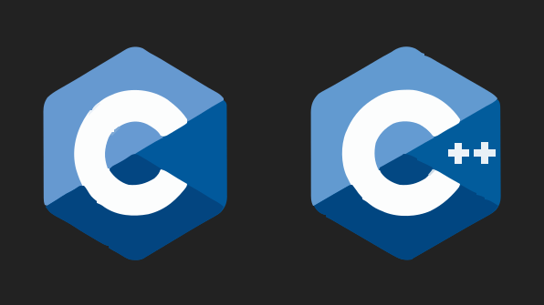
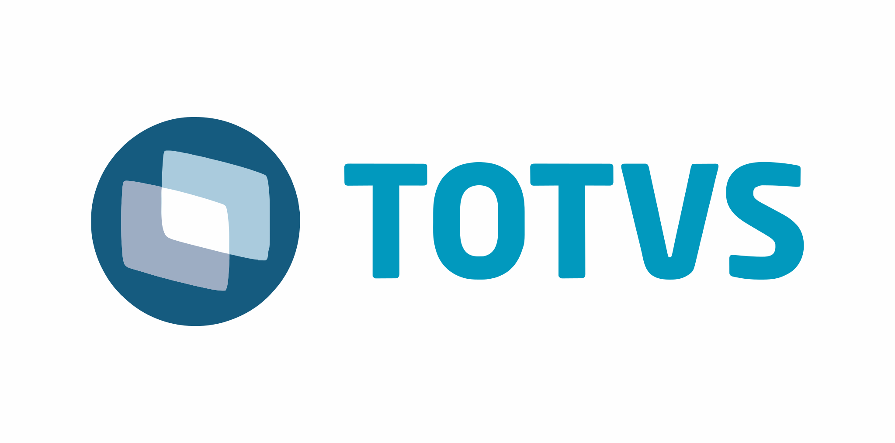
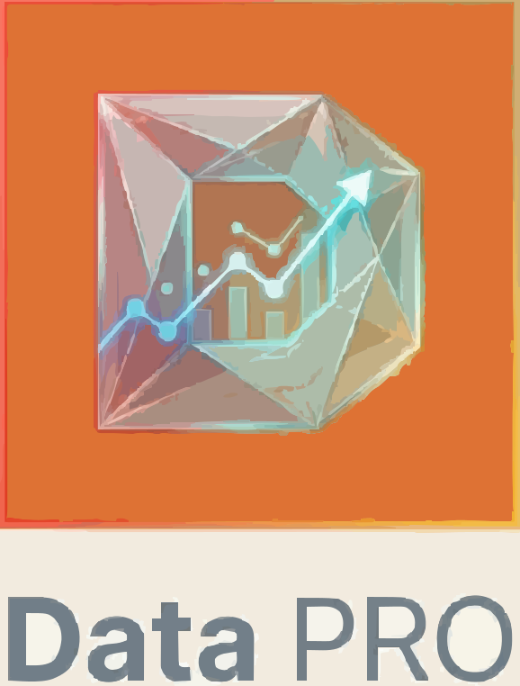

   

   
   
    
   
  

---

### 

 
  
<h2>
  

    
  

  </h2>

  
  
  
  
  
  
  
  
  
  
  
  

---

### 

 
  
<h2>
 

   
 

 </h2>

#### **Specialist (Analista de Dados) | PwC (Big Four)** — *2022 - Atual*

#### **Controlador de Produção (PCP) | BRASIMPAR** — *2020 - 2022*

---

### 

 
  
<h2>
 

   
 

 </h2>

 

  
  

